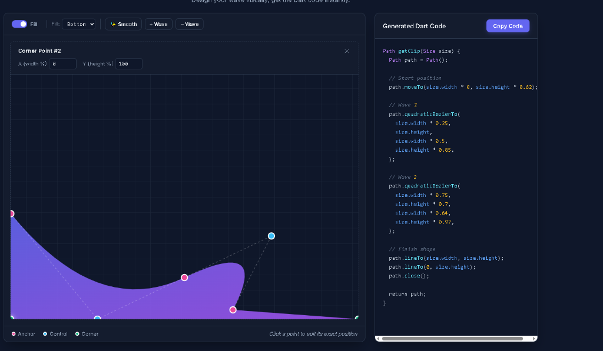

# 🌊 Flutter Wave Generator

A professional, interactive, browser-based visual design tool for generating Flutter `CustomClipper` code. Say goodbye to guessing `x` and `y` coordinate values in Dart—design your shapes visually, drag control points perfectly, and copy-paste the production-ready code straight into your Flutter app!



## ✨ Features

- **Interactive Canvas:** Click and drag any point to reshape your wave in real-time.
- **Smart Orientation Engine:** Choose between `Top`, `Bottom`, `Left`, or `Right` wave fill modes. The engine dynamically maps your coordinates so your design stays exactly the way you want it.
- **Multi-polygon Editor:** Beyond just a single wave, you can now build complex polygonal borders around your shapes!
- **180° Flip Tool:** Mirror your design horizontally or vertically with a single click.
- **Auto-Generating Code Panel:** Production-ready `Path()` Dart code updates continuously as you tweak your design.

## 🕹️ Interactive Tutorial

The generator provides extremely powerful edge-manipulation tools. Here is how to master the canvas:

### 1. Moving the Entire Design
Click anywhere inside the **colored area** (the fill) and drag your mouse to move the entire design around the canvas as a solid object.

### 2. Double Click: Add Corner Anchors
Double-click anywhere on the straight boundaries (bottom, left, or right edges) to insert a new **Green Corner Point**. You can use this to transform a standard box into a fully custom polygonal shape!

### 3. Long Press: Add Curved Borders
Click and hold (**Long Press** for 0.5s) on any straight boundary to instantly turn it into a curved Bezier line! This will spawn a **Blue Control Point** exactly where you are holding, giving you full control over the curvature of that edge.

### 4. Right Click: Delete Points
Made a mistake or added too many custom points to your edges? Simply **Right-Click** any point on the boundary to instantly delete it and revert the shape.

---

## 🚀 How to use in your Flutter App

Once your design is perfect, click **Copy Code**.

1. Create a new Dart file in your Flutter project, for example `wave_clipper.dart`.
2. Create a class that extends `CustomClipper<Path>` and paste the generated `getClip` method inside:

```dart
import 'package:flutter/material.dart';

class MyWaveClipper extends CustomClipper<Path> {
  @override
  Path getClip(Size size) {
    // ⬇️ PASTE THE GENERATED CODE HERE ⬇️
    Path path = Path();
    path.moveTo(0, size.height * 0.5);
    // ...
    return path;
    // ⬆️ PASTE THE GENERATED CODE HERE ⬆️
  }

  @override
  bool shouldReclip(CustomClipper<Path> oldClipper) => true; // Reclip when properties change
}
```

3. Wrap any widget (like a `Container` or an `Image`) with the `ClipPath` widget and apply your new clipper!

```dart
ClipPath(
  clipper: MyWaveClipper(),
  child: Container(
    height: 300,
    decoration: BoxDecoration(
      gradient: LinearGradient(
        colors: [Colors.purpleAccent, Colors.deepPurple],
      ),
    ),
    child: Center(
      child: Text(
        'Beautiful Waves!',
        style: TextStyle(color: Colors.white, fontSize: 24),
      ),
    ),
  ),
)
```

Enjoy building beautiful UI in Flutter!
